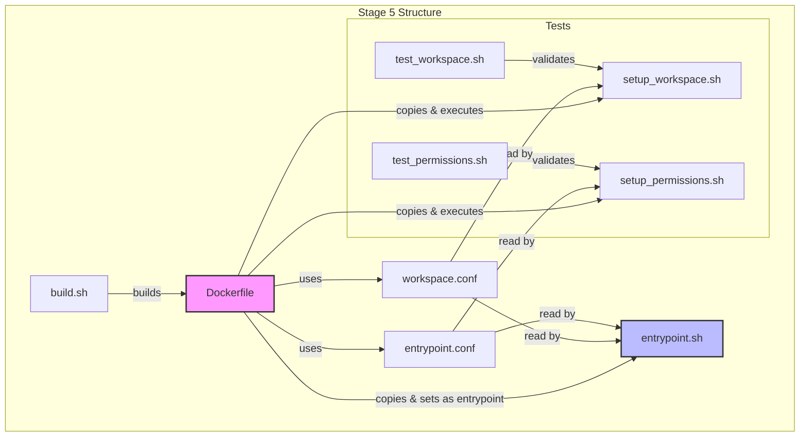

让我用 Mermaid 图表来展示第五阶段（Stage 5）所有文件的关系和功能流程：

### 文件功能说明（File Function Description）：

1. **配置文件（Configuration Files）**:
   - `workspace.conf`: 定义工作空间结构和开发环境设置（Defines workspace structure and development environment settings）
   - `entrypoint.conf`: 定义容器运行时配置和用户权限（Defines container runtime configuration and user permissions）

2. **脚本文件（Script Files）**:
   - `setup_workspace.sh`:
     - 创建工作空间目录结构（Creates workspace directory structure）
     - 设置开发环境配置（Sets up development environment configuration）
     - 由 Dockerfile 在构建时执行（Executed by Dockerfile during build）

   - `setup_permissions.sh`:
     - 配置用户和组权限（Configures user and group permissions）
     - 设置资源限制（Sets resource limits）
     - 由 Dockerfile 在构建时执行（Executed by Dockerfile during build）

   - `entrypoint.sh`:
     - 容器启动入口点（Container startup entry point）
     - 初始化服务（Initializes services）
     - 验证环境（Verifies environment）
     - 作为容器的主进程（Acts as container's main process）

   - `build.sh`:
     - 构建最终 Docker 镜像（Builds final Docker image）
     - 处理构建参数（Handles build arguments）
     - 复制配置文件（Copies configuration files）

3. **测试脚本（Test Scripts）**:
   - `test_workspace.sh`: 验证工作空间设置（Validates workspace setup）
   - `test_permissions.sh`: 验证权限配置（Validates permission configuration）

4. **Dockerfile**:
   - 基于 Stage 4 镜像构建（Builds upon Stage 4 image）
   - 复制并设置所有配置文件和脚本（Copies and sets up all configs and scripts）
   - 执行设置脚本（Executes setup scripts）
   - 配置入口点（Configures entrypoint）

### 执行流程（Execution Flow）：

1. `build.sh` 启动构建过程（Initiates build process）
2. Dockerfile 执行构建步骤（Dockerfile executes build steps）:
   - 复制配置文件（Copies config files）
   - 复制并执行设置脚本（Copies and executes setup scripts）
3. 容器启动时（When container starts）:
   - `entrypoint.sh` 作为主进程运行（entrypoint.sh runs as main process）
   - 读取配置文件（Reads config files）
   - 初始化服务和环境（Initializes services and environment）

测试脚本可以在任何时候运行，用于验证设置是否正确（Test scripts can run anytime to validate setup）。